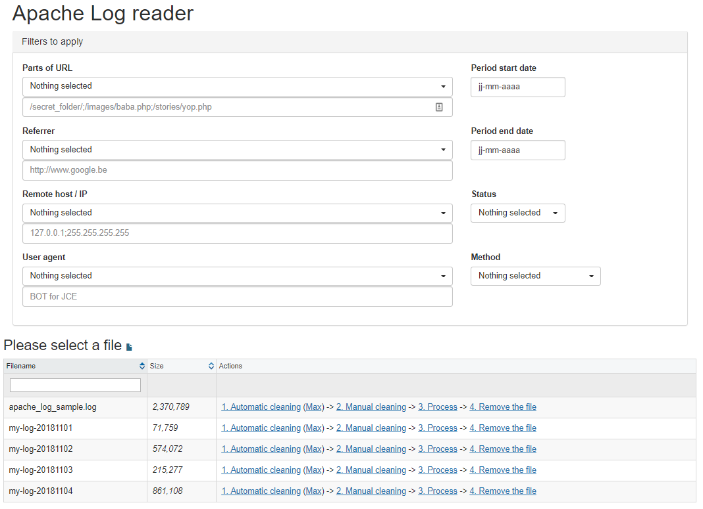
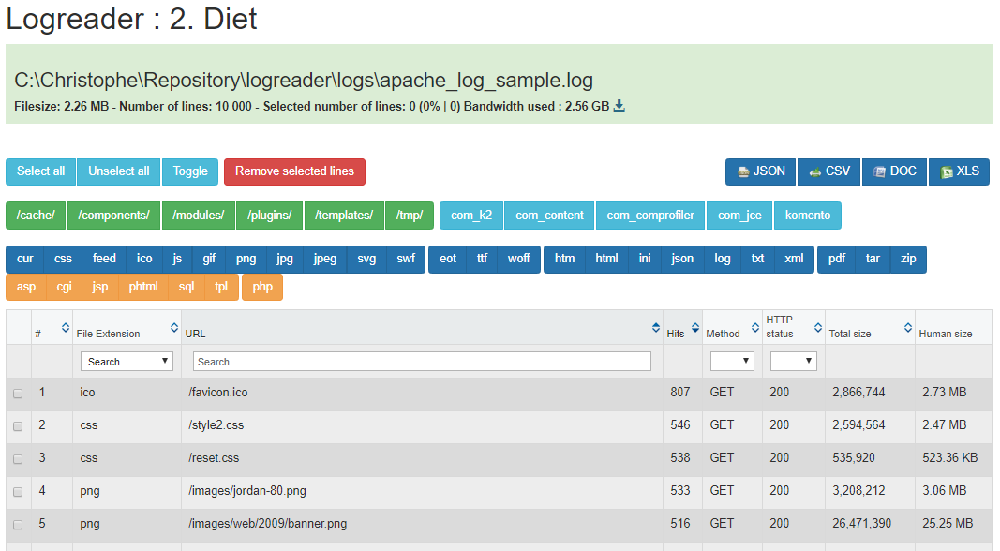
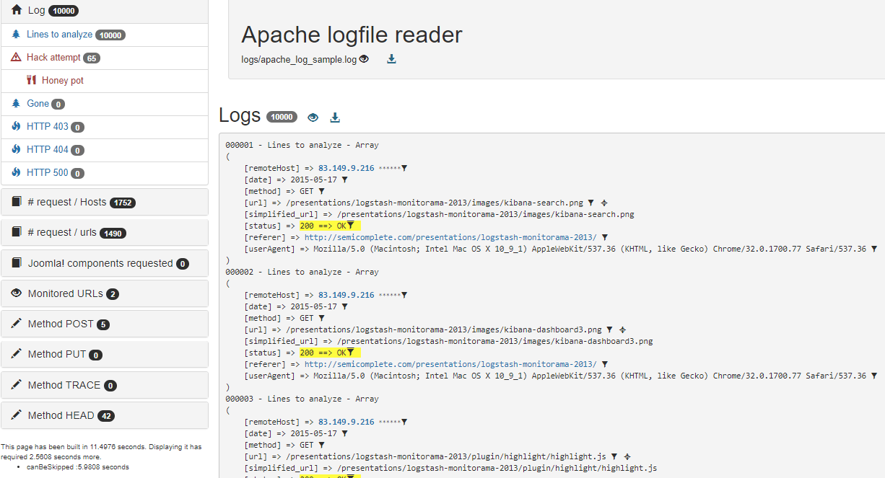

# Apache Log reader

> Interface that allows you to analyze the log of web access to your site's resources and highlight URL attack attempts

Log reader is a web interface that will allow you to manipulate your Apache log files by:

- Removing a lot of noise (clean URLs and remove as much as possible unneeded lines)
- Show an interface where you'll be able to make more cleaning, manually, like selecting and removing specific URLs (pointing to a sub folder, having such extension, ...)
- Then display an interface that will help you to analyze each requests by taking into account the HTTP status code, the IP, the dangerousness of an URL and much more.

## Table of Contents

- [Install](#install)
- [Usage](#usage)
- [Configuration](#configuration)
- [Notes](#notes)
- [License](#license)

## Install

1. Get a copy of this repository to your localhost website
2. Get a copy of your Apache log file from your hosting company and save the file into the `/logs` folder of this application

## Usage

Start the application (probably by running `http://localhost/log_reader` where `log_reader` is your localhost alias).

### 1. Select a file

First, you'll need to select a file (those that have been stored in the `/logs` folder).

From this screen, you can also specify filters, f.i., filter for a specific IP address, Referrer, ... to see only lines matching these filters from your logs.

### 2. Manual cleaning

Once your filters have been applied, click on the `2. Manual cleaning` hyperlink to show an interface where URLs will be grouped together.

Requests will be grouped by `URL` and you'll see f.i. how many times that specify URL (without parameters) has been requested.

The interface offers several options to allow you to filter your file and delete from it the lines you do not want to analyze in more detail.

Click on the `Remove selected lines` to remove these lines from the logfile on disk.

When done, you can close the browser's tab and comes back to the first interface (the file selection). There, click on the `3. Process` action.

### 3. Process

The process screen will display a lot of information's that will help you to understand what happens on your site like which requests have been successfully delivered (http status code 200), which have been denied (code 403), ...

You'll be able to analyze requests by IP, by HTTP methods (GET, POST, ...) and much more.

## Configuration

If you need to change something, take a look on the `logreader.json` file. You'll find it in the root folder.

## Notes

1. The demo Apache logfile comes from [Elasticsearch examples](https://github.com/elastic/examples/tree/master/Common%20Data%20Formats/apache_logs)
2. I wrote this script at the end of 2015 and, a priori, I don't think I'm going to make it evolve. I decided to share it too it is publicly accessible on GitHub. If you use it and improve it, it would be nice to share your work.

## License

[MIT](LICENSE)
